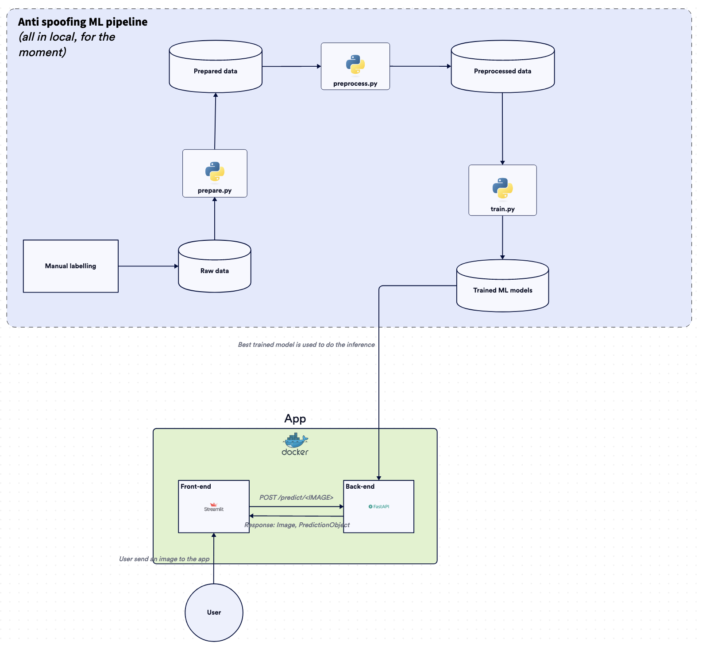

# Anti-spoofing for face recognition

[](https://sonarcloud.io/summary/new_code?id=reda-maizate_anti_spoofing) [](https://sonarcloud.io/summary/new_code?id=reda-maizate_anti_spoofing) [](https://sonarcloud.io/summary/new_code?id=reda-maizate_anti_spoofing) [](https://sonarcloud.io/summary/new_code?id=reda-maizate_anti_spoofing) [](https://sonarcloud.io/summary/new_code?id=reda-maizate_anti_spoofing)

This project was made to recognize if the given image is from live or a spoofed one.
The dataset is available on [Kaggle](https://www.kaggle.com/datasets/tapakah68/anti-spoofing).

*This project was also made to learn the entire fabric of Deep Learning life cycle.*

## Infrastructure

🚧 Currently working in the v1.0.0... 🚧



## Usage

### Set up the environment

**DISCLAIMER**: If you are not using an M1 macOS, you need to update the files below.
- `enviroment.yml`
- `requirements.txt`

After updated this files, use the following command to create the conda environment:

```bash
conda env create -f environment.yml
```

### Set up the development environment

**DISCLAIMER**: If you are not using an M1 macOS, you need to update the files below.
- `enviroment-dev.yml`
- `requirements-dev.txt`

After updated this files, use the following command to create the conda environment:

```bash
conda env create -f environment-dev.yml
```